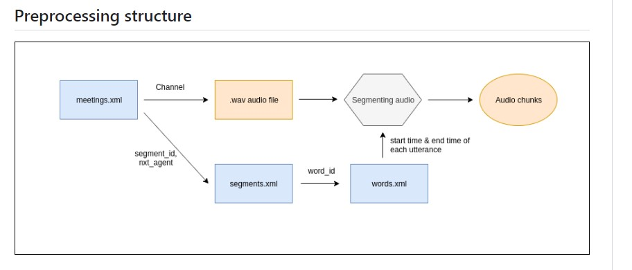
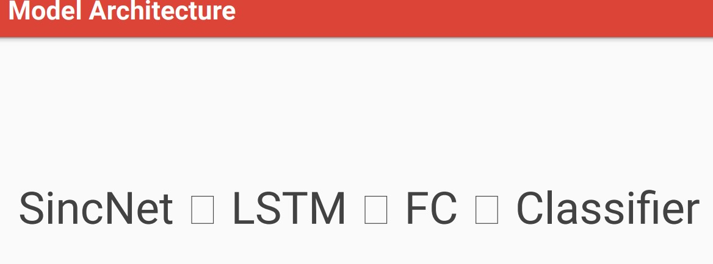

# VSegmentation
   - detect speech in any audio that contain more speakers and detect who and when   
     speak in audio .

# Dataset
 - AMI Meeting Corpus 
    ○ 100 hours of meeting recordings 
   ○ English  
   ○ Recorded in three different rooms with different acoustic properties 
   ○ Mostly non-native speakers 
   ○ Split into train, test, and development sets 
   ○ Groundtruth: RTTM files (one speech turn per line with start time and duration) 

## PREPROCESSING
 -	Load data using pyannote.database
 -	Read RTTM files 
 -	Split into 293 frames

 

## Model Architecture 
 

 ## Research Paper
  - https://arxiv.org/abs/2104.04045

## OUTPUT 
    RTTM 
      SPEAKER ES2011a 1 34.27 10.12 <NA> <NA> FEE041 <NA> <NA>
      SPEAKER ES2011a 1 46.43 10.42 <NA> <NA> FEE041 <NA> <NA>

## Checkpoint 

